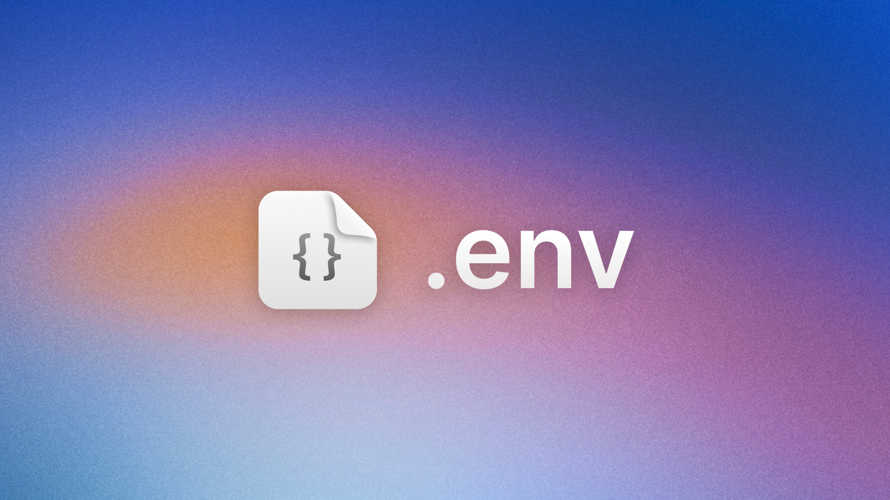

# env-scan

A CLI tool that automatically detects environment variables used in your codebase and manages your `.env` file.


## Features

- 🔍 Scans your codebase 
- ✨ Creates a `.env` file if it doesn't exist
- 🔄 Updates `.env` with newly detected environment variables
- 📋 Preserves existing environment variable values
- 🚫 Avoids duplicates by only adding new variables

## Installation

### Global Installation

```bash
npm install -g env-scan
```

### Project Installation

```bash
npm install --save-dev env-scan
```

## Usage

### Command Line

Simply run:

```bash
npx env-scan
```
Or,
```bash
env-scan
```


Or if installed locally:

```bash
npx env-scan
```


